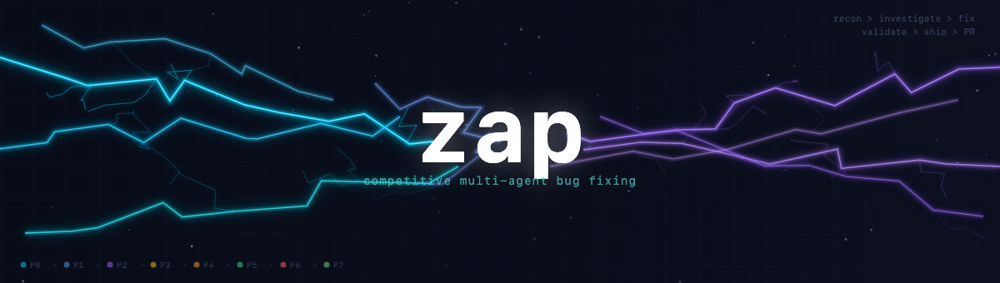
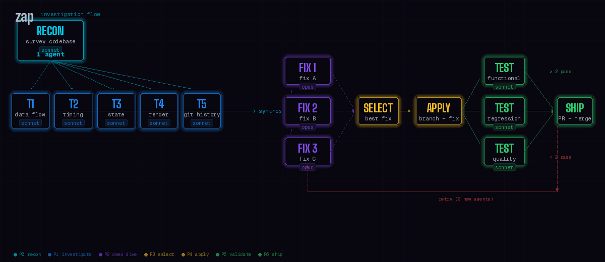

# zap

A Claude Code plugin that fixes bugs using competitive multi-agent investigation. When a bug resists your first few attempts, zap throws a squad of agents at it - recon, parallel theories, competing fixes, independent validation - and commits a fix.

## How It Works



**8 phases, fully autonomous:**

| Phase | What happens | Agents | Model |
|-------|-------------|--------|-------|
| **P0 Recon** | Survey codebase, git history, run tests | 3 (or 1) | Sonnet |
| **P1 Investigate** | 3 theories tested in parallel; early exit on confirmed | 3 | Sonnet |
| **P2 Deep dive** | Top 1–2 theories get fix implementations | 1–2 | Opus + Sonnet |
| **P3 Select** | Orchestrator picks the best fix | - | - |
| **P4 Apply** | Winner applied to a feature branch | - | - |
| **P5 Validate** | 3 testers check functional, regression, quality | 3 | Haiku |
| **P6 Ship/Retry** | Quality gates (security + cleanup) in parallel, commit, push, create PR; competitive retry on partial fail | 0–4 | Haiku/Opus |
| **P7 PR Feedback** | Check for CI, wait if needed, evaluate and fix valid suggestions | - | - |

Every agent runs in an isolated git worktree. No agent can break your working tree.

## Usage

```
/zap <describe the bug>
```

After the fix is committed, a PR is created, and automated review feedback is addressed. Use `/zap-cleanup` to merge and clean up:

```
/zap-cleanup [branch-name]
```

This merges the fix branch to main, removes agent worktrees, and deletes temporary branches.

Options:

| Flag | Effect |
|------|--------|
| `--single-recon` | Use 1 recon agent instead of 3 parallel (cheaper, slower) |
| `--no-security` | Skip the security review quality gate |
| `--no-cleanup` | Skip code simplification & beautification quality gate |

Examples:

```
/zap thumbnails don't update after importing a 3D model

/zap race condition in WebSocket reconnect - messages dropped on fast network switches

/zap build fails on CI but passes locally, something about asset paths

/zap --single-recon off-by-one in pagination
```

## What Makes It Different

**Parallel recon before theories.** Three specialized agents - code reader, git archaeologist, test runner - survey the codebase simultaneously before anyone starts guessing. Theories are grounded in evidence, not vibes.

**Agents compete, not collaborate.** Independent theories, independent fixes. No groupthink. The best fix wins on merit.

**Early termination on confirmed root cause.** If an investigation agent confirms the root cause with strong evidence, zap skips the remaining theories and goes straight to implementing the fix - saving agents and tokens.

**Context trimming between phases.** Downstream agents receive focused briefs, not raw dumps. Recon reports are capped, and fix agents get only the evidence relevant to their theory. Less noise, lower token cost.

**Validation is adversarial.** 3 independent testers try to break the fix from different angles. 2 of 3 must pass. No rubber-stamping.

**Retry is competitive.** If validation partially fails, 2 new agents compete to revise the fix using failure feedback. One more shot before giving up.

**Quality gates before shipping.** After validation passes, a security reviewer scans for OWASP Top 10 vulnerabilities and a cleanup agent runs the project's linter/formatter and simplifies the code - all before the commit lands. Disable with `--no-security` or `--no-cleanup`.

**PR feedback loop.** After the PR is created, zap checks for CI/webhooks and waits only if they exist, then evaluates each suggestion - implementing valid ones and rejecting incorrect ones with reasons.

**Code search MCP support.** If a code search MCP is installed (e.g. `code-index-mcp`), recon and investigation agents automatically use it for faster, more targeted code discovery.

## Install

```bash
claude plugins add github:moogento/zap
```

Then restart Claude Code. `/zap` will be available in all projects.

## When to Use It

- Bug has resisted your first couple of fix attempts
- Root cause is unclear or could be multiple things
- Bug spans multiple files or layers of the stack
- You want a fix validated before you commit to it
- You're stuck and want fresh (parallel) perspectives

## When Not to Use It

- Typo fixes, obvious one-liners
- You already know the root cause and just need to write the fix
- The bug is in a file you haven't read yet (read it first, you might not need zap)

## Cost

A full run spawns ~10–16 agents across all phases. Expect roughly:
- **Best case (confirmed root cause):** ~10 agents (3 recon + 3 investigate + 1 fix + 3 test) + quality gates + PR feedback
- **Typical run:** ~12 agents (3 recon + 3 investigate + 2 fix + 3 test + 2 quality gates) + PR feedback
- **With retry:** ~16 agents (add 2 fix + 2–3 retest) + PR feedback
- **Model mix:** Sonnet for recon/investigation, Opus for primary fix, Haiku for testing/quality gates

Use it for bugs that justify the investment.

## Requirements

- Claude Code CLI
- Git repository (worktrees require it)
- That's it - no dependencies, no config, no build step

## License

MIT
